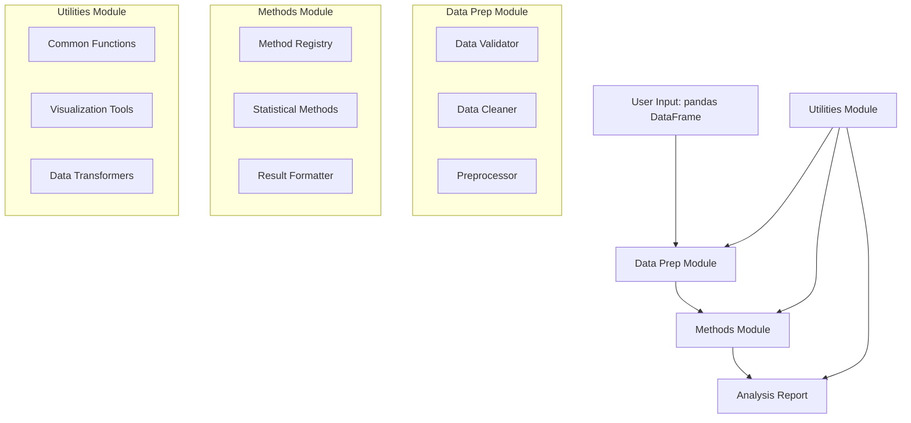

# Design Document: no_nonsense_experiment_analysis

## Overview

The `no_nonsense_experiment_analysis` package is a Python library that provides a streamlined interface for experimental data analysis. Built as a companion to the no_nonsense_experimental_design repository, it follows a clear three-module architecture: data preparation, experimental methods, and shared utilities. The package is designed around pandas DataFrames as the primary data structure and emphasizes a workflow-driven approach that culminates in LLM-ready structured reports.

The design prioritizes simplicity, consistency, and reproducibility. Each module has a clear responsibility, and the package supports both individual function usage and complete workflow execution. The architecture enables easy extension with new experimental methods while maintaining backward compatibility.

## Architecture

The package follows a modular architecture with three main components:



The architecture supports both imperative usage (calling individual functions) and declarative usage (defining complete workflows). State management is handled through immutable data transformations, ensuring reproducibility and enabling easy debugging.

## Components and Interfaces

### Core Workflow Manager

The `WorkflowManager` class orchestrates the complete analysis pipeline:

```python
class WorkflowManager:
    def __init__(self, data: pd.DataFrame):
        self.original_data = data
        self.current_data = data.copy()
        self.analysis_history = []
        self.results = {}
    
    def prep(self, **kwargs) -> 'WorkflowManager':
        # Delegates to data_prep module
        pass
    
    def analyze(self, method: str, **kwargs) -> 'WorkflowManager':
        # Delegates to methods module
        pass
    
    def report(self) -> 'AnalysisReport':
        # Generates structured report
        pass
```

### Data Preparation Module (`data_prep`)

**DataValidator**: Validates input DataFrames against schema requirements
- `validate_dataframe(df: pd.DataFrame, schema: Dict) -> ValidationResult`
- `check_required_columns(df: pd.DataFrame, columns: List[str]) -> bool`
- `validate_data_types(df: pd.DataFrame, type_map: Dict) -> List[str]`

**DataCleaner**: Handles missing values, duplicates, and outliers
- `handle_missing_values(df: pd.DataFrame, strategy: str) -> pd.DataFrame`
- `remove_duplicates(df: pd.DataFrame, subset: List[str]) -> pd.DataFrame`
- `detect_outliers(df: pd.DataFrame, method: str) -> pd.Series`

**Preprocessor**: Transforms data for analysis
- `normalize_columns(df: pd.DataFrame, columns: List[str]) -> pd.DataFrame`
- `encode_categorical(df: pd.DataFrame, columns: List[str]) -> pd.DataFrame`
- `create_features(df: pd.DataFrame, feature_specs: Dict) -> pd.DataFrame`

### Methods Module (`methods`)

**MethodRegistry**: Manages available experimental methods
- `register_method(name: str, method_class: Type[ExperimentalMethod])`
- `get_method(name: str) -> ExperimentalMethod`
- `list_available_methods() -> List[str]`

**ExperimentalMethod** (Abstract Base Class): Interface for all methods
```python
class ExperimentalMethod:
    def validate_inputs(self, data: pd.DataFrame, **kwargs) -> bool:
        pass
    
    def execute(self, data: pd.DataFrame, **kwargs) -> MethodResult:
        pass
    
    def get_parameters(self) -> Dict[str, Any]:
        pass
```

**MethodResult**: Standardized result container
```python
@dataclass
class MethodResult:
    method_name: str
    parameters: Dict[str, Any]
    statistics: Dict[str, float]
    p_values: Dict[str, float]
    confidence_intervals: Dict[str, Tuple[float, float]]
    effect_sizes: Dict[str, float]
    metadata: Dict[str, Any]
```

### Utilities Module (`utilities`)

**StatisticalFunctions**: Common statistical operations
- `calculate_effect_size(group1: pd.Series, group2: pd.Series) -> float`
- `bootstrap_confidence_interval(data: pd.Series, statistic: Callable) -> Tuple[float, float]`
- `multiple_comparison_correction(p_values: List[float], method: str) -> List[float]`

**VisualizationTools**: Plotting utilities
- `plot_distribution(data: pd.Series, **kwargs) -> matplotlib.Figure`
- `plot_comparison(groups: Dict[str, pd.Series], **kwargs) -> matplotlib.Figure`
- `plot_results_summary(results: List[MethodResult], **kwargs) -> matplotlib.Figure`

**DataTransformers**: Data manipulation utilities
- `pivot_experimental_data(df: pd.DataFrame, **kwargs) -> pd.DataFrame`
- `aggregate_by_groups(df: pd.DataFrame, group_cols: List[str]) -> pd.DataFrame`
- `calculate_summary_statistics(df: pd.DataFrame) -> Dict[str, Any]`

## Data Models

### Core Data Structures

**ValidationResult**: Result of data validation
```python
@dataclass
class ValidationResult:
    is_valid: bool
    errors: List[str]
    warnings: List[str]
    data_summary: Dict[str, Any]
```

**AnalysisReport**: LLM-ready structured report
```python
@dataclass
class AnalysisReport:
    dataset_summary: Dict[str, Any]
    preprocessing_steps: List[str]
    methods_applied: List[str]
    results: List[MethodResult]
    overall_conclusions: Dict[str, Any]
    metadata: Dict[str, Any]
    
    def to_json(self) -> str:
        pass
    
    def to_llm_prompt(self) -> str:
        pass
```

**WorkflowState**: Tracks analysis progress
```python
@dataclass
class WorkflowState:
    current_step: str
    completed_steps: List[str]
    data_shape: Tuple[int, int]
    applied_transformations: List[str]
    validation_status: ValidationResult
```

### Data Flow

Data flows through the system as immutable transformations:

1. **Input**: Raw pandas DataFrame
2. **Validation**: ValidationResult with data quality assessment
3. **Preparation**: Cleaned pandas DataFrame with transformation log
4. **Analysis**: MethodResult objects with statistical outputs
5. **Reporting**: AnalysisReport with structured findings

Each transformation preserves the original data and maintains a complete audit trail of operations performed.

## Error Handling

The package implements a hierarchical error handling strategy:

**Custom Exception Hierarchy**:
```python
class AnalysisError(Exception):
    """Base exception for analysis package"""
    pass

class DataValidationError(AnalysisError):
    """Raised when data validation fails"""
    pass

class MethodExecutionError(AnalysisError):
    """Raised when method execution fails"""
    pass

class WorkflowError(AnalysisError):
    """Raised when workflow execution fails"""
    pass
```

**Error Recovery**: Each component implements graceful degradation where possible, logging warnings for non-critical issues while raising exceptions for critical failures that would compromise analysis integrity.

**User Guidance**: Error messages include specific remediation steps and links to documentation where appropriate.

## Testing Strategy

The package employs a dual testing approach combining unit tests and property-based tests:

**Unit Testing**:
- Test specific examples and edge cases for each component
- Validate error conditions and exception handling
- Test integration points between modules
- Focus on concrete scenarios with known expected outputs

**Property-Based Testing**:
- Verify universal properties across all valid inputs using Hypothesis
- Test data transformation invariants
- Validate statistical method properties
- Ensure workflow consistency across different data shapes and types
- Minimum 100 iterations per property test
- Each property test tagged with: **Feature: no-nonsense-experiment-analysis, Property {number}: {property_text}**

**Testing Configuration**:
- Use pytest as the primary testing framework
- Use Hypothesis for property-based testing
- Achieve minimum 90% code coverage
- Include performance benchmarks for large dataset handling
- Test against multiple pandas versions for compatibility

## Correctness Properties

*A property is a characteristic or behavior that should hold true across all valid executions of a system—essentially, a formal statement about what the system should do. Properties serve as the bridge between human-readable specifications and machine-verifiable correctness guarantees.*

Based on the prework analysis, the following properties capture the essential correctness requirements for the no_nonsense_experiment_analysis package:

### Data Validation Properties

**Property 1: Input type validation**
*For any* input object, the system should accept it if and only if it is a pandas DataFrame
**Validates: Requirements 1.4**

**Property 2: Validation completeness**
*For any* pandas DataFrame input, validation should check structure, content, data types, and required columns, returning a complete ValidationResult
**Validates: Requirements 1.1, 1.3**

**Property 3: Error message descriptiveness**
*For any* validation failure, the error messages should contain specific details about what failed and which columns or data types were problematic
**Validates: Requirements 1.2, 7.1**

### Data Preparation Properties

**Property 4: Data integrity preservation**
*For any* DataFrame and any cleaning operation, the original DataFrame should remain completely unchanged after the operation
**Validates: Requirements 2.5**

**Property 5: Cleaning operation consistency**
*For any* DataFrame with data quality issues (missing values, duplicates, outliers), applying the same cleaning operation multiple times should produce the same result
**Validates: Requirements 2.1, 2.3, 2.4**

**Property 6: Output type guarantee**
*For any* valid preprocessing operation on a DataFrame, the output should always be a pandas DataFrame with the same or fewer rows
**Validates: Requirements 2.6**

### Method Execution Properties

**Property 7: Method result standardization**
*For any* experimental method execution with valid inputs, the result should always be a MethodResult object containing method_name, parameters, statistics, and metadata fields
**Validates: Requirements 3.3, 3.6**

**Property 8: Method chaining compatibility**
*For any* sequence of compatible methods, the output of one method should be valid input for the next method in the chain
**Validates: Requirements 3.5**

**Property 9: Parameter validation consistency**
*For any* method and any invalid parameter set, the system should raise a MethodExecutionError with clear guidance about valid parameter ranges
**Validates: Requirements 3.4, 7.3**

### Utility Function Properties

**Property 10: Mathematical operation correctness**
*For any* mathematical utility function and valid numerical inputs, the results should be mathematically equivalent to reference implementations
**Validates: Requirements 4.5**

**Property 11: Interface consistency**
*For any* utility function, the calling convention should follow the same pattern: accept standard inputs, return standard outputs, and handle errors consistently
**Validates: Requirements 4.6**

### Workflow Properties

**Property 12: Workflow state preservation**
*For any* workflow execution, the state should be correctly maintained between steps, allowing step-by-step execution and recovery
**Validates: Requirements 5.4**

**Property 13: Workflow validation chain**
*For any* workflow step completion, the output should be validated before proceeding to the next step, and invalid outputs should prevent progression
**Validates: Requirements 5.2**

**Property 14: Complete workflow execution**
*For any* valid DataFrame input, executing the complete workflow (load → prep → analyze → report) should produce a comprehensive AnalysisReport
**Validates: Requirements 5.1, 5.5**

### Reporting Properties

**Property 15: Report completeness**
*For any* completed analysis, the generated AnalysisReport should contain all statistical results, method parameters, data summaries, and metadata from the analysis
**Validates: Requirements 6.1, 6.2, 6.5**

**Property 16: Report serialization round-trip**
*For any* AnalysisReport object, serializing to JSON and then deserializing should produce an equivalent report object
**Validates: Requirements 6.6**

**Property 17: Multi-method consolidation**
*For any* analysis using multiple methods, the AnalysisReport should consolidate all results into a coherent structure without losing information from any individual method
**Validates: Requirements 6.4**

### Error Handling Properties

**Property 18: Error context preservation**
*For any* exception raised during workflow execution, the exception should include context about the current workflow step and the operation that failed
**Validates: Requirements 7.5**

**Property 19: Warning generation without interruption**
*For any* data quality issue that doesn't prevent analysis, the system should log warnings but continue execution successfully
**Validates: Requirements 7.4**